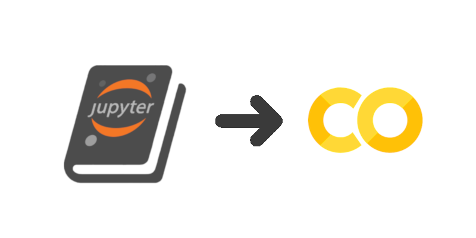
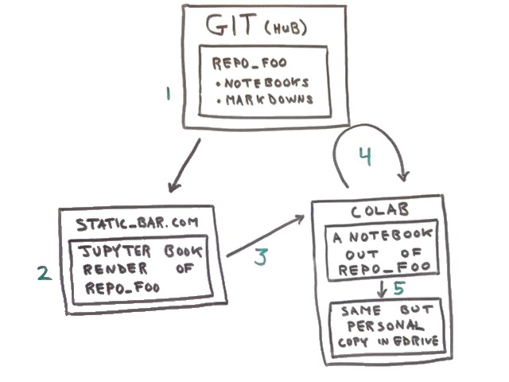

# Jupyter Book and Colab



At Reconstrue, a simple Jupyter-centric document production pipeline
used multiple times has been Jupyter Book linked to Google's
Colab.

Jupyter Book is a static site generator (SSG) for a git repo
full of Jupyter notebooks. [Colab](https://colab.research.google.com/)
is a free Jupyter hosting service provided by Google. Google Colab is
to Google Sheets as a Python notebook is to a JavaScript spread sheet.

So, SSG render the repo via Jupyter Book and if some readers wish to
go beyond static HTML and wants to launch a VM to run a Jupyter
kernel, then send them on to Colab, via a link which includes the ID
of the notebook the user is being sent from in order to continue the
reading experience smoothly.

This whole thing boils down to one small HTML hack, and a lot of
explanation of what the hack enables (static sites and free compute).

Static sites can be easily hosted anywhere. In combination with a free
Jupyter hosting service, such as Google Colab, it means having a
scalable Jupyter cluster for free, and no management or user admin
hassles. Google handles auth (anyone with a Google account) and the
provisioning of two VMs per user.

(There are other free Jupyter hosters: Binder, Kaggle, Azure
Notebooks, more all the time. Colab is the best UX, with lots of
memory and nice GPUs.)


## Jupyter Book

Static Site Generators (SSGs) have been around for a while and are the
bee's knees. In the Jupyter notebook world, a tool called 
[Jupyter Book](https://jupyterbook.org/intro) is the best notebook SSGer.

Basicly, Jupyter Book is a great tool where the input is a repo full
of `*.ipynb` and `*.md` files plus a table of contents. The output is
a static files "book" of the Jupyter notebooks as if they were run
through "nbconvert" to HTML.

Jupyter Book takes a git repository as input. The repository contains
Jupyter notebooks (`*.ipynb` files) and Markdown files (`*.md` files).
Additionally there is a concept of a Table of Contents (a YAML files),
which specifies the start page of the "book." 

At Reconstrue, Jupyter Book has been used to generate static site
renderings of repos, which in turn serve as the intro home page for
the repo on the web. The rendered notebooks can optionally include
output cells full of a previous run, or they can be cleared of any
outputs.

Such a static file home page can be hosted anywhere. In particular, if
the source git repo is hosted on GitHub, the rendering can be used as
the GitHub Pages site for the repo.

Jupyter Book can be configured to provide an optional "Interact
button" that users can click to get forwarded to a live Jupyter hosting
service, traditionally JupyterHub or Binder. 

Simply hacking on a HTML
template in Jupyter Book was enough to get the code to where it could
also link to Colab, as well.


## Jupyter Book to Colab


In the context of Jupyter-Book-interact-Colab deploy, any given
Jupyter notebook `.ipynb` file in the reop can have four manifestions.



Even more confusingly, in this case `static_bar.com` is actually
`github.io`, the GitHub Pages site, not github.com.

(GitHub Pages is a free service github.io: a static website for any repos on
github.com. A.k.a. `gh-pages` branches back in the day.)

Let's walk through the five steps.

### 1. The source notebook at home

A git repository is archived somewhere, say, Microsoft GitHub (but it
could be any git repo). In the context of this post the repo is one
built out to work with Jupyter Book, which means is it essentially
just a collection of Jupyter notebooks and markdown files.

### 2. Pre-run notebook as HTML

For step 2, the repo has been fetched from GitHub and run through
Jupyter Book with the output being a bunch of static web content
(HTML, JavaScript, CSS, and images).

Static web sites are the simplest kind of web site: they are simply
file servers talking HTTP. In this diagram the example static site is
http://static-bar.com.

### 3. Hand off to Colab

This is what in Jupyter Book is referred to as interacting, moving
from a static web page rendering of an (optionally pre-run) notebook
to something backed by a live Jupyter kernel. Normally, Jupyter Book
will hand off to Binder for provisioning Jupyter kernels. In my hack,
open source Binder is replaced with commercial 
[Google Colab](https://colab.research.google.com/).

The hand off is simply an `http://` URL to Colab, which includes/ends-with a
map to the `.ipynb` file that Colab should load from GitHub. That mapping
will result in an URL of the form:

```
https://colab.research.google.com/github/my_org/my_repo/blob/my_branch/my_file.ipynb
```

### 4. Colab kernel spin-up

Next, the web browser follows the `http://colab.research.google.com` URL,
loading a new web page. At Colab, an HTTP GET arrives and the URL is
parsed. When colab sees the `/github/` part, it knows that the user is
requesting that an `.ipynb` file be fetched from GitHub. The tail of
the URL provides the organization, repo name, and relative file
path. Colab then fetches the specified file from `github.com`.

Behind the scene Colab spins up a new virtual machine to provide a
Jupyter kernel for the request. (Anyone with a gMail email address can
have up to two VMs running simultaneously.)

Eventually (quickly) the HTTP response goes down to the browser where
the user sees the notebook and can run the code. 

### 5. Persisting a modified version

"Playground mode" is the Colab term for a transient, unpersisted
version of a notebook running in a Colab VM.  If a reader wants to
play with and run the code (read: modify the input notebook) and keep
a copy, exiting playground mode will save a copy of the modified
`.ipynb` in the users Google Drive.

**The take away is** that open source tools make it possible to have a
static web site showing HTML rendering of `.ipynb` files. Those static
HTML files can then link to Colab (or Binder) to on-demand hook the
notebook up to a new VM. **A static web site linking to free compute.**


## The Hack

So, with all the explaining out of the way, the solution boils down to
a small hack of the HTML templates in Jupyter Book. It's not even
really a hack, just an unexpected novel use, which is what is enabled
by good technologies like Jupyter Book.

Jupyter Book already has a customization hook for providing a button
uses can click to be taken to some site where JupyterHub (or Docker)
is running. The code where the hook is used in in the 
[jupyterhub.html](https://github.com/jupyter/jupyter-book/blob/master/jupyter_book/book_template/_includes/buttons/jupyterhub.html#L9)
template. It's a bit gruesome but the point is all the info needed
to build the equivalent URL for Colab is there: site, repo, branch, etc.:

```html
hub/user-redirect/git-pull?repo={{ site.binder_repo_base }}/{{ site.binder_repo_org }}/{{ site.binder_repo_name }}&amp;branch={{ site.binder_repo_branch }}&amp;subPath={{ page.interact_link | url_encode }}&amp;app={{ hub_app }}
{{ site.images_url | relative_url }}/logo_jupyterhub.svg
<a href="{{ site.jupyterhub_url }}/{{ interact_url_jupyterhub }}"><button class="interact-button" id="interact-button-jupyterhub">{{ site.jupyterhub_interact_text }}</button></a>
```

So, the "hack" is simply a modification of one of the HTML templates that are in the content repo, not part of the jupyter-book tool's repo. So this is a good hack. Just change the above to:
```html
{{ site.binder_repo_org }}/{{ site.binder_repo_name }}/blob/{{ site.binder_repo_branch }}/{{ page.interact_link }}
https://colab.research.google.com/assets/colab-badge.svg
<a href="{{ site.jupyterhub_url }}/github/{{ interact_url_jupyterhub }}"><button class="interact-button" id="interact-button-jupyterhub">{{ site.jupyterhub_interact_text }}</button></a>
```
